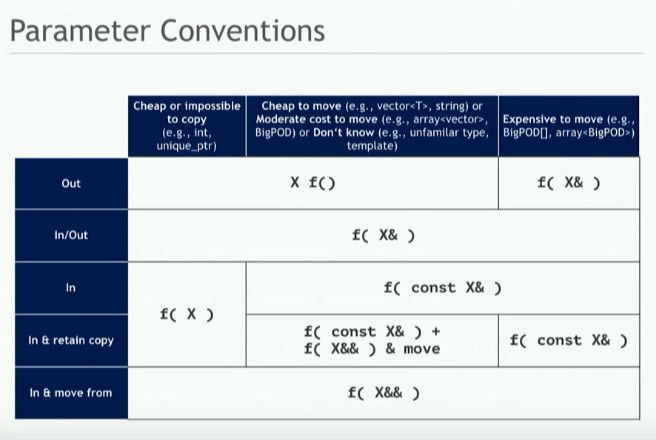

# Learning C++

Key takeaways - **very complicated**

- need to understand many decades of language development to appreciate why C++ is the way it is today.

## Initialization

https://blog.tartanllama.xyz/initialization-is-bonkers/

- 18 ways of initializing stuff

## Move semantics


#### Presentations on the topic:

- [CppCon 2019 - Klaus Iglberger "Back to Basics: Move Semantics" (part 1)](https://www.youtube.com/watch?v=St0MNEU5b0o)
- [CppCon 2019 - Klaus Iglberger "Back to Basics: Move Semantics" (part 2)](https://www.youtube.com/watch?v=pIzaZbKUw2s)



- screenshot from Klaus Ilgberger's presentation

#### Key terms:

- rule of zero, rule of three, rule of five (https://en.cppreference.com/w/cpp/language/rule_of_three)
- perfect forwarding (`std::forward`), forwarding reference

## Templates

- form of compile-time duck-typing - you don't know if it will compile until template substitution occurs.

## C++20 Concepts

... haven't tried yet.

## Other parts of the standard library

`std::variant`, `std::optional` etc...

- coming from Rust I feel like I overuse `std::variant` and `std::optional`

## Trailing return type syntax

https://arne-mertz.de/2016/11/trailing-return-types-everywhere/

```c++
template<class T, class U>
auto multiply(T const& lhs, U const& rhs) -> decltype(lhs * rhs) {
  return lhs * rhs;
}
```

versus return type deduction:

```c++
template<class T, class U>
auto multiply(T const& lhs, U const& rhs) {
  return lhs * rhs;
}
```